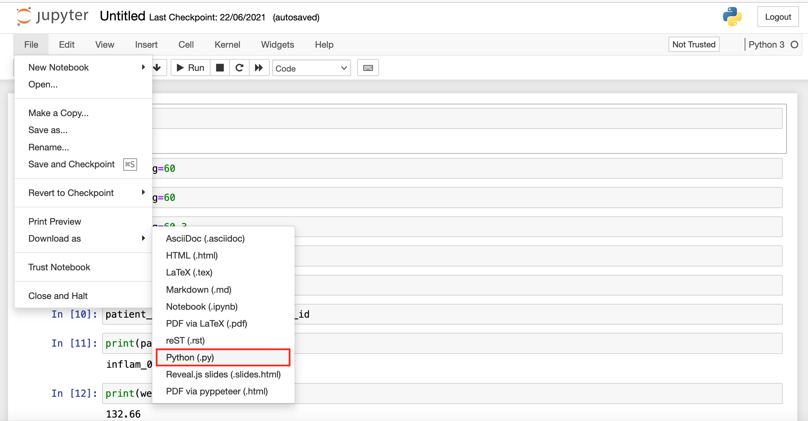

## Preparing the data
So far we have been working on Jupyter Notebooks which is a very convenient method to
develop Python code on our local computers. However, remote HPC systems are often 
prepared to be accessed and interacted with more efficiently through the command 
line. This require us to export our code from a Jupyter Notebook to a format more
suitable for command line work. Fortunately, Jupyter Notebooks makes this step a
simple one with an option to download our Notebook as a Python script:




After choosing an appropiate name and saving the file, we should have a Python script
(a text file) with entries similar to:

~~~
#!/usr/bin/env python
# coding: utf-8

# In[1]:


3 + 5 * 8


# In[2]:


weight_kg=60

~~~
{: .language-python}

Notice the `# In[X]:` that mark the position of corresponding cells in our Jupyter
Notebook and are kept for reference. We can keep them in place, they won't cause any
trouble as they are included as comments (due to the initial `#`), but if we wanted
to remove them we could do it by hand or more efficiently by using the command line
tool `sed` to find and delete lines that start with the characters `# [` and to 
delete empty lines (`^` is used by `sed` to indicate the beginning of a line and `$`
to indicate the end):

~~~
sed -e '/# In/d' -e '/^$/d' lesson1.py > lesson1_cleaned.py
~~~
{: .language-bash}

This will produce the `lesson1_cleaned.py` file with entries similar to:

~~~
#!/usr/bin/env python
# coding: utf-8
3+5+8
weight_kg=60
~~~
{: .language-python}


## Copying data

Once we have exported our data into Python scripts it is time to transfer them to the
remote HPC system. Depending on our platform we can do this in a couple of ways:

{::options parse_block_html="true" /}
<div>
  <ul class="nav nav-tabs" role="tablist">
   <li role="presentation" class="active"><a data-os="windows" href="#Windows" aria-controls="Windows" role="tab" data-toggle="tab">Windows</a></li>
   <li role="presentation"><a data-os="macos" href="#MacOS" aria-controls="MacOS" role="tab" data-toggle="tab">MacOS/Linux</a></li>
  </ul>
 
 <div class="tab-content">
  <article role="tabpanel" class="tab-pane active" id="Windows">
   On Windows you can use [MobaXterm](https://mobaxterm.mobatek.net/) to transfer 
   files to Hawk from you local computer.

<!--
   |    |    |
   |:--:|:--:|
   |  |  |
-->

<!--
  |  |  |
-->

  |                  |                  |
  |:----------------:|:----------------:|
  | <figure>  </figure> <br /> Click on **Session** to open the different connection methods available in MobaXterm |  <br /> Select **SFTP** and enter the Remote Host (*hawklogin.cf.ac.uk*) and your **Hawk username** |
  | | |
  | <figure>  </figure> <br /> Locate the directory in your local computer and drag and drop to the remote server on the rigth pane. ||

  </article>
 
  <article role="tabpanel" class="tab-pane" id="MacOS">
    MacOS and Linux provide the command `scp -r` that can be used to recursively copy
    your work directory over to your home directory in Hawk:

    $ scp -r arcca-python hawk-username@hawklogin.cf.ac.uk:/home/hawk-username
    ...
    python-novice-inflammation-code.zip                100% 7216   193.0KB/s   00:00
    Untitled.ipynb                                     100%   67KB 880.2KB/s   00:00
    inflammation.png                                   100%   13KB 315.6KB/s   00:00
    argv_list.py                                       100%   42     0.4KB/s   00:00
    readings_08.py                                     100% 1097    10.6KB/s   00:00
    readings_09.py                                     100%  851    24.8KB/s   00:00
    ...
  </article>
 </div>
</div>

## Setup your work environment
Remote HPC systems may provide some default versions of Python. On Hawk you can check
this with:

```
$ python --version
Python 2.7.5

$ python3 --version
Python 3.6.8
```

However, it is unlikely that the system will provide all the packages you need by 
default. Fortunately you are free to install software libraries locally in your home
directory.

### Create a Python venv
There are a few alternative methods to install Python libraries on Hawk including 
Anaconda virtual environments an Python venv + Pip. Both have advantages and 
disadvantages but we will use the latter for this training course as the environment
we need to setup is relatively simple.


