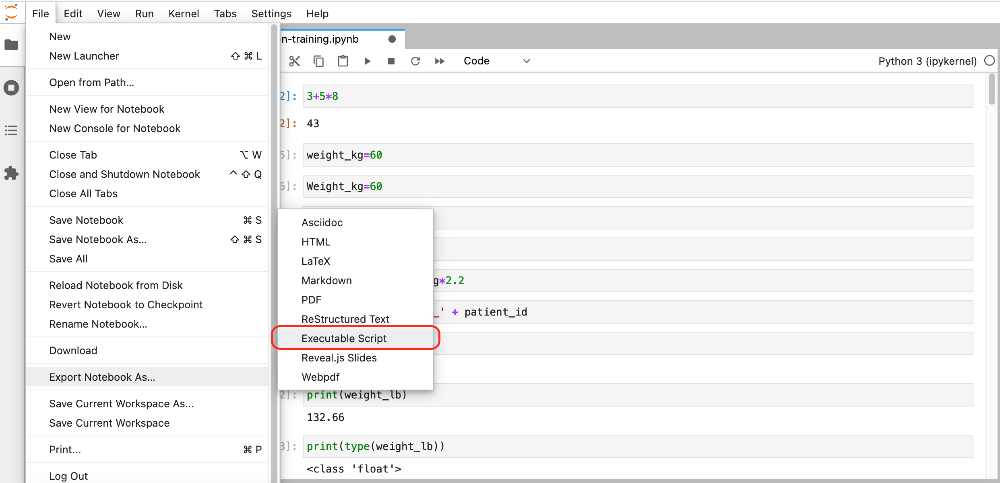

## Running Jupyter Notebooks on a remote HPC systems

Although the most traditional way to interact with remote HPC and cloud systems 
is through the command line (via the `ssh` and `scp` commands) some systems also
offer graphical user interfaces for some services. Specifically, on Hawk you can 
deploy
Jupyter Notebooks via [OnDemand](https://openondemand.org/) (a web portal that
allow you to work with HPC systems interactively). The notes below provide
instructions for both methods of access: through OnDemand and through a `ssh` 
*tunnel*.

{::options parse_block_html="true" /}
<div>
  <ul class="nav nav-tabs" role="tablist">
   <li role="presentation" class="active"><a data-os="ssh-tunnel" href="#SSH" 
       aria-controls="SSH" role="tab" data-toggle="tab">SSH tunnel</a></li>
   <li role="presentation"><a data-os="ondemand" href="#OnDemand" 
       aria-controls="OnDemand" role="tab" data-toggle="tab">OnDemand</a></li>
  </ul>

 <div class="tab-content">
  <article role="tabpanel" class="tab-pane active" id="SSH">

  To access a Jupyter Notebook server via an `ssh` tunnel you need first to 
  login to Hawk:

  ```
  $ ssh hawk-username@hawklogin.cf.ac.uk
  ```

  Once logged in, confirm that Python 3 is accessible:

  ```
  $ module load compiler/gnu/9
  $ module load python/3.7.0
  $ python3 --version
  ```
  ~~~
  Python 3.7.0
  ~~~
  {: .output}

  We need to install Jupyter Notebooks on our user account on the remote server
  (we will discuss more about installing Python packages later on):

  ```
  $ python3 -m venv create my_venv
  $ . my_venv/bin/activate
  $ python3 -m pip install jupyterlab
  ```

  The installation process will try to download several dependencies from the 
  internet. Be patient, it shouldn't take more than a couple of minutes.

  Now, this is important, the Jupyter Notebook server must be run on a *compute
  node*, please take a look at our best practices guidelines in the 
  [SCW portal](https://portal.supercomputing.wales/index.php/best-practice/).
  If the concept of login and compute nodes is still not clear at this point 
  don't worry too much (but you can find out more in out 
  [Supercomputing for Beginners training course](https://arcca.github.io/hpc-intro/).
  For now, run the following command to instruct the Hawk job scheduler to run 
  a Jupyter Notebook server on a compute node:

  ```
  $ srun -n 1 -p htc --account=scwXXXX -t 1:00:00 jupyter-lab --ip=0.0.0.0
  ```

  ~~~
  http://ccs1015:8888/?token=77777add13ab93a0c408c287a630249c2dba93efdd3fae06
  or http://127.0.0.1:8888/?token=77777add13ab93a0c408c287a630249c2dba93efdd3fae06
  ~~~
  {: .output}

  Next, open a new terminal and create a ssh tunnel using the node and port 
  obtained in the previous step (e.g. ccs1015:8888):
  
  ```
  $ ssh -L8888:ccs1015:8888 hawk-username@hawklogin.cf.ac.uk
  ```

  You should be able to navigate to http://localhost:8888 in your web browser 
  (use the token provided in the output if needed). If everything went well, you
  should see something like: 

  

  Where you should be able to access the files stored your Hawk user account.


  </article>

  <article role="tabpanel" class="tab-pane" id="OnDemand">
  1.  Go to [ARCCA OnDemand](https://arcondemand.cardiff.ac.uk) portal (this
      requires access to [Cardiff University VPN](https://intranet.cardiff.ac.uk/staff/supporting-your-work/it-support/wireless-and-remote-access/off-campus-access/virtual-private-network-vpn) ).
  2.  Enter your details: Hawk username and password. Once logged in you should
      land on a page with useful information including the usual Message of the
      Day (MOD) commonly seen when logging in to Hawk via the terminal.

      |          |          |
      |:--------:|:--------:|
      |  |  |
      | | |

  3.  Go to "Interactive Apps" in the top menu and select "Jupyter Notebook/Lab". 
      This will bring you to a form where you can specify for how much time the
      desktop is required, number of CPUs, partition, etc. You can also choose
      to receive an email once the desktop is ready for you. Click the *Launch*
      button to submit the request.

      |          |          |
      |:--------:|:--------:|
      |  |  |
      | | |

  4.  After submission you request will be placed on the queue and will wait
      for resources, hopefully for a short period, but this *depends on the 
      number of cores as well as time requested*, so please be patient. At this
      point you can close the OnDemand website and come back at a later point 
      to check progress or wait for the email notification if the option was 
      selected.

      Once your request is granted you should be able to see a *Running* message, 
      the amount of resources granted and the time remaining.

      Click *Connect to Jupyter* to launch the Jupyter in a new web browser tab.

      |          |          |
      |:--------:|:--------:|
      |  |  |
      | | |

  5.  You should now have the familiar interface of Jupyter Notebooks in front of
      you. It will show the documents and directories in your user account on 
      Hawk. To create a new Notebook, go to the dropdown menu *New* on the right
      side and click on *Python 3 (ipykernel)*. A new tab will open with a new
      notebook ready for you to start working.

      |          |          |
      |:--------:|:--------:|
      |  |  |
      | | |

  </article>
 </div>
</div>




## Copying data

To keep working on Hawk with the Notebooks we have written locally in our 
Desktop computer we need to transfer them over. Depending on our platform we
can do this in a couple of ways:

{::options parse_block_html="true" /}
<div>
  <ul class="nav nav-tabs" role="tablist">
   <li role="presentation" class="active"><a href="#copy-Windows"  aria-controls="copy-Windows"  role="tab" data-toggle="tab">Windows    </a></li>
   <li role="presentation"               ><a href="#copy-MacOS"    aria-controls="copy-MacOS"    role="tab" data-toggle="tab">MacOS/Linux</a></li>
   <li role="presentation"               ><a href="#copy-OnDemand" aria-controls="copy-OnDemand" role="tab" data-toggle="tab">OnDemand   </a></li>
  </ul>
 
 <div class="tab-content">
  <article role="tabpanel" class="tab-pane active" id="copy-Windows">
  On Windows you can use [MobaXterm](https://mobaxterm.mobatek.net/) to 
  transfer files to Hawk from your local computer.

  |                  |                  |
  |:----------------:|:----------------:|
  | <figure>  </figure> <br /> Click on **Session** to open the different connection methods available in MobaXterm |  <br /> Select **SFTP** and enter the Remote Host (*hawklogin.cf.ac.uk*) and your **Hawk username** |
  | | |
  | <figure>  </figure> <br /> Locate the directory in your local computer and drag and drop to the remote server on the right pane. ||

  </article>
 
  <article role="tabpanel" class="tab-pane" id="copy-MacOS">
  MacOS and Linux provide the command scp -r that can be used to recursively 
  copy your work directory over to your home directory in Hawk:
  
  ```
  $ scp -r arcca-python hawk-username@hawklogin.cf.ac.uk:/home/hawk-username
  python-novice-inflammation-code.zip           100% 7216   193.0KB/s   00:00
  Untitled.ipynb                                100%   67KB 880.2KB/s   00:00
  inflammation.png                              100%   13KB 315.6KB/s   00:00
  argv_list.py                                  100%   42     0.4KB/s   00:00
  readings_08.py                                100% 1097    10.6KB/s   00:00
  readings_09.py                                100%  851    24.8KB/s   00:00
  ```

  </article>

  <article role="tabpanel" class="tab-pane" id="copy-OnDemand">
  With OnDemand you can also download and upload files to Hawk. In this 
  example we will upload the directory with the Jupyter Notebooks we have 
  created so far. Go to `Files` and select the directory where you wish to 
  upload the files (our home directory in this case), then select `Upload`
  and locate the directory in your local computer. Once uploaded, the files
  should be available on Hawk:

  |                  |                  |
  |:----------------:|:----------------:|
  |  |  |
  |  |  |

  </article>

 </div>
</div>

## Setup your Jupyter Notebook work environment

Depending on how you started your Jupyter Notebook you should have access to
some default packages. But these are not guaranteed to be the same (this also
applies for the version of Python) between the OnDemand and the `ssh` tunnel 
methods. Moreover, it is unlikely that the remote HPC system would provide 
every package you need by default.

### Installing Python libraries

The **recommended approach** is to create a conda virtual environment with a 
`environemnt.yml` file which includes a list of all packages (and versions)
needed for your work. This file can be created and used in your local computer
and then copied to Hawk to reproduce the same environment. An example file is:

~~~
name: my-conda-env
dependencies:
  - python=3.9.2
  - numpy
  - pandas
  - ipykernel
~~~
{: .language-yaml}

The package `ipykernel` is required here to make the environment reachable from
Jupyter Notebooks. You can find more about creating an `environment.yml` file 
in the [Anaconda documentation](https://docs.conda.io/projects/conda/en/latest/user-guide/tasks/manage-environments.html#create-env-file-manually).

On Hawk you need to first load Anaconda:

```
$ module load anaconda/2020.02
$ source activate
$ which conda
```

~~~
/apps/languages/anaconda/2020.02/bin/conda
~~~
{: .output}

And then proceed to install the virtual environment:

```
$ conda env create -f environment.yml
```

~~~
...
libffi-3.3           | 50 KB     | ##################################### | 100%
numpy-1.21.2         | 23 KB     | ##################################### | 100%
pandas-1.3.4         | 9.6 MB    | ##################################### | 100%
mkl-2021.4.0         | 142.6 MB  | ##################################### | 100%
six-1.16.0           | 18 KB     | ##################################### | 100%
Preparing transaction: done
Verifying transaction: done
Executing transaction: done
#
# To activate this environment, use
#
#     $ conda activate my-conda-env
#
# To deactivate an active environment, use
#
#     $ conda deactivate
~~~
{: .output}

We can then follow the instructions printed at the end of the installation 
process to activate our environment:

```
$ conda activate my-conda-env
$ which python
```

~~~
~/.conda/envs/my-conda-env/bin/python
~~~
{: .output}

We can further confirm the version of Python used by the environment:

```
$ python --version
```

~~~
Python 3.9.2
~~~
{: .output}

To deactivate the environment and return to the default Python provided by the
system (or the loaded module):

```
$ conda deactivate
$ python --version
```

~~~
Python 3.7.6
~~~
{: .output}

### Using an Anaconda virtual environment from Jupyter Notebooks

We can access our newly installed Anaconda environment from Jupyter Notebooks
on OnDemand. For this, create a new session and when the resources are granted
click on `Connect to Jupyter`. On Jupyter Lab you might be asked to choose 
which kernel to start, if so, select the name given to your virtual environment
(*my-conda-env*) in this example:

 

If another kernel is loaded by default, you can still change it by clicking on
the top right corner of your Notebook, a similar menu should appear:

  |                  |                  |
  |:----------------:|:----------------:|
  |  |  |

If all goes well you should be able to confirm the Python versions and path, as
well as the location of the installed libraries:


At this point you should have all the packages required to continue working on 
Hawk as if you were working on your local computer.


### A more efficient approach

During these examples we have been requesting only 1 CPU when we launch our 
Jupyter Notebook and that, hopefully, has caused our request to be fulfilled
fairly quickly. However, there will be a point where 1 CPU is no longer enough
(maybe the application has become more complex or there is more data to analyse,
and memory requirements have increased). At that point you can modify the 
requirements and increase the number of CPUS,  memory, time or devices (GPUs).
One point to keep in mind when increasing requirements is that this will impact
the time it takes for the system scheduler to deliver your request and allocate
you the resources, the higher the requirements, the longer it will take.

When the time spent waiting in queue becomes excessive it is worth considering
moving away from the Jupyter Notebook workflow towards a more traditional 
Python script approach (**recommended for HPC systems**). The main difference
between them is that while Jupyter Notebooks is ideal for the development 
stages of a project (since you can test things out in real time and debug if 
needed), the Python script approach is better suited for the production stages
where the needed for supervision and debugging is reduced. Python scripts also 
have the advantage, on HPC systems, of being able to be queued for resources
and automatically executed when these are granted without you needing to be 
logged in the system.

So, how do we actually transfer our Jupyter Notebook to a Python script?
Fortunately, Jupyter Notebook developers thought of this requirement and added
a convenient export method to the Notebooks (the menus might be different
depending on if Jupyter Notebooks or Jupyter Lab was launched from OnDemand):

|                  |                  |
|:----------------:|:----------------:|
|  |  |
| Download from Jupyter Notebook | Download from Jupyter Lab |

After choosing an appropriate name and saving the file, we should have a Python 
script (a text file) with entries similar to:

~~~
#!/usr/bin/env python
# coding: utf-8

# In[1]:


3 + 5 * 8


# In[2]:


weight_kg=60

~~~
{: .language-python}

Notice the `# In[X]:` that mark the position of corresponding cells in our
Jupyter Notebook and are kept for reference. We can keep them in place, they
won't cause any trouble as they are included as comments (due to the initial
`#`), but if we wanted to remove them we could do it by hand or more 
efficiently by using the command line tool `sed` to find and delete lines that
start with the characters `# [` and to delete empty lines (`^` is used by `sed`
to indicate the beginning of a line and `$` to indicate the end):

**(from this point onwards we move away from Jupyter Notebooks and start typing
commands on a terminal connected to Hawk)**

```
sed -e '/# In/d' -e '/^$/d' lesson1.py > lesson1_cleaned.py
```

This will produce the `lesson1_cleaned.py` file with entries similar to:

~~~
#!/usr/bin/env python
# coding: utf-8
3+5+8
weight_kg=60
~~~
{: .language-python}

Now that we have our Python script, we need to create an additional file (job
script) to place it in the queue (submit the job). Make sure to remove any
commands from the Python script that might need additional confirmation or user
interaction as you won't be able to provide it with this method of execution.
The following is the content a job script that is equivalent to how we have 
been requesting resources through OnDemand:

~~~
#!/bin/bash

#SBATCH -J test             # job name
#SBATCH -n 1                # number of tasks needed
#SBATCH -p htc              # partition
#SBATCH --time=01:00:00     # time limit
#SBATCH -A scwXXXX          # account number

set -eu

module purge
module load anaconda/2020.02
module list

# Load conda
source activate

# Load our environment
conda activate my-conda-env

which python
python --version

python my-python-script.py

~~~
{: .language-bash}

To submit (put it queue) the above script, on Hawk:

```
$ sbatch my-job-script.sh
```

~~~
Submitted batch job 25859860
~~~
{: .output}

You can query the current state of this job with:

```
$ squeue -u $USER
```

~~~
    JOBID       PARTITION    NAME    USER      ST    TIME  NODES NODELIST(REASON)
    25860025    htc          test    c.xxxxxxx PD    0:00      1 ccs3004
~~~
{: .output}

This particular job might not spend a long time in queue and the above output
might not show it, but on completion there should be a `slurm-<job-id>.out`
created in the current directory with the output produced by our script.

There is a lot more to know about working with HTC systems and job schedulers,
once you are ready to go this route, take a look at our documentation and 
training courses on these topics:

- [**Supercomputing for Beginners**](https://arcca.github.io/hpc-intro): Why 
  use HPC? Accessing systems, using SLURM, loading software, file transfer and
  optimising resources.
- [**Slurm: Advanced Topics**](https://arcca.github.io/slurm_advanced_topics):
  Additional material to interface with HPC more effectively.

> ## Need help?
> 
> If during the above steps you found any issues or have doubts regarding your
> specific work environment, get in touch with us at arcca-help@cardiff.ac.uk.
{: .callout}



